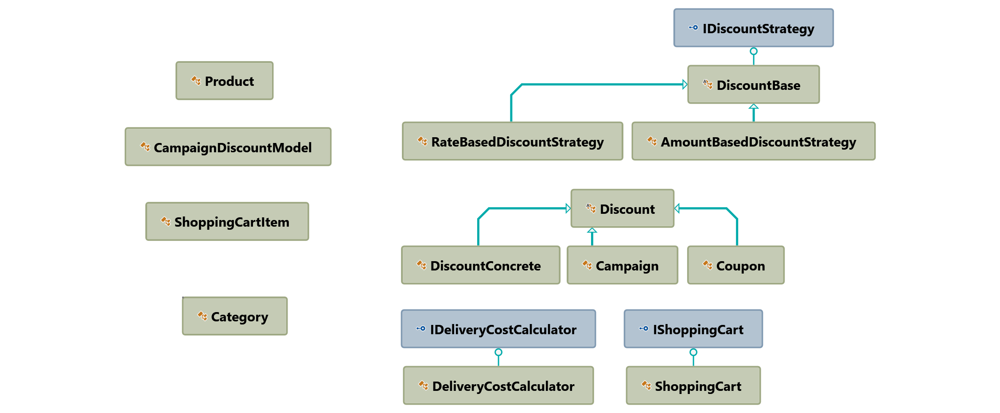

# Shopping Cart Implementation
This project is a simple implementation of a shopping cart as console application. 
Basicly, it provides these abilities by considering some predefined rules.
- Adding products onto Shopping Cart
- Applying campaigns
- Applying/removing coupon
- Calculating delivery price

## Used Tools - Language - Technologies
- C#
- .Net Core 3.1
- Visual Studio 2019 Community Edition
- dotCover
- NUnit
- Moq Library

## Class Dependency Diagram

This is the general structure of the project.

## Test Coverage

<a href="SolutionItems/TestCoverageReport.zip" download>Click to Download the coverage report</a>
